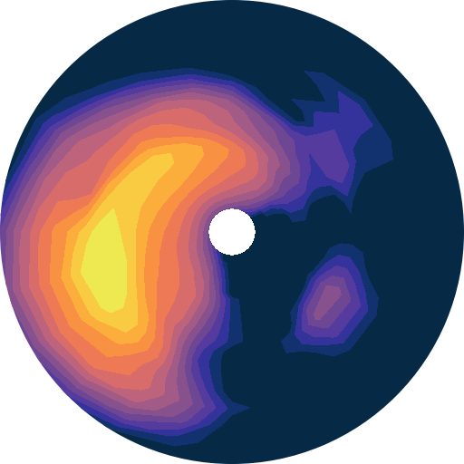

============
Partitioning
============

Spectral partitioning splits the wave spectrum into components such as wind sea and
swells, so integrated parameters can be calculated for each individual wave system.
Most methods in wavespectra are based on the watershed algorithm of
`Hanson et al. (2009)`_ implemented in spectral wave models such as WW3 and SWAN.

The partitioning methods are available from the ``spec.partition`` namespace (in
version 4 this namespace replaced the previous ``partition`` method, see
:doc:`migration`):

- :meth:`~wavespectra.partition.partition.Partition.ptm1`
- :meth:`~wavespectra.partition.partition.Partition.track`
- :meth:`~wavespectra.partition.partition.Partition.ptm2`
- :meth:`~wavespectra.partition.partition.Partition.ptm3`
- :meth:`~wavespectra.partition.partition.Partition.ptm4`
- :meth:`~wavespectra.partition.partition.Partition.ptm5`
- :meth:`~wavespectra.partition.partition.Partition.hp01`
- :meth:`~wavespectra.partition.partition.Partition.bbox`

The `PTM` methods are named after the convention in the `WAVEWATCHIII`_ spectral wave
model from which they were derived (`TRACK` runs one of the partitioning methods and
tracks the partitions in time).

The `HP01` method implements the combining of nearby swell partitions (in spectral
space) described in `Hanson and Phillips (2001)`_ and `Hanson et al. (2009)`_. Adjacent
partitions are combined when the saddle point between them is high relative to the
smaller of the two peaks, or when their peaks are close relative to the spectral
spread of either partition and their mean directions agree. An exact number of swell
partitions can be requested, in which case the least separated partitions are further
combined until the requested number is reached.

The `STEEPNESS` method is a variation of `PTM1` that classifies the wind sea from the
wave steepness of each topographic partition rather than from a wave age criterion
based on the wind, so it requires no wind input.

The `BBOX` method is a custom method to split the energy
density inside and outside a defined bounding box in spectral space.

When partitioning from a Dataset with the ``dataset_transforms`` option set with
``wavespectra.set_options(dataset_transforms=True)``, the output is a Dataset
carrying the non-spectral variables from the source dataset, and the ``wspd``,
``wdir`` and ``dpt`` arguments default to the dataset variables with those names so
the methods that require them can be called without arguments, e.g.
``dset.spec.partition.ptm1()``. This will become the default behaviour in
wavespectra 5.0; until then, partitioning from a Dataset without the option set
returns the partitioned spectra as a DataArray and emits a ``FutureWarning``. When
partitioning from a DataArray, the partitioned spectra are returned as a DataArray
and the wind and depth arguments must be prescribed.

.. list-table::
   :header-rows: 1
   :widths: 14 46 20 20

   * - Method
     - Description
     - Classifies wind sea / swell
     - Requires wind and depth
   * - ``ptm1``
     - Watershed with all wind-sea partitions combined into partition 0
     - yes
     - yes
   * - ``track``
     - Any of ``ptm1``, ``ptm2``, ``ptm3``, ``steepness`` or ``hp01``, with the
       partitions tracked in time into wave systems
     - as per method
     - as per method
   * - ``ptm2``
     - As ``ptm1``, with a secondary wind sea split from the swell partitions
     - yes
     - yes
   * - ``ptm3``
     - Plain watershed partitions, no wind-sea classification
     - no
     - no
   * - ``ptm4``
     - Wave-age split into one wind sea and one swell, no watershed
     - yes
     - yes
   * - ``ptm5``
     - Frequency-threshold split, no watershed
     - no
     - no
   * - ``hp01``
     - Watershed with combining of swells from the same wave system, supports
       prescribing an exact number of output partitions
     - yes
     - optional
   * - ``steepness``
     - As ``ptm1``, with the wind sea identified from the partition steepness
       instead of the wave age
     - yes
     - depth only
   * - ``bbox``
     - Split inside/outside a bounding box in spectral space
     - no
     - no

Some parameters are shared by several methods:

* ``agefac``: Wave age factor used in the wind-sea criterion; spectral bins whose
  celerity is smaller than ``agefac`` times the local wind speed component are
  considered under wind forcing.
* ``wscut``: Wind-sea fraction cutoff; watershed partitions whose wind-forced energy
  fraction exceeds this value are classified as wind sea.
* ``ihmax``: Number of discrete levels used to bin the spectra in the watershed
  algorithm.
* ``swells`` (``parts`` in ``ptm3``): Number of partition slots in the output
  ``part`` dimension; smaller partitions are dropped (or combined in ``hp01`` and
  ``steepness``) and missing slots are null-padded. Setting it to None sizes the output from the
  largest number of partitions detected across all spectra, at the cost of an extra
  pass over the data.

.. ipython:: python
    :okwarning:

    import numpy as np
    import xarray as xr
    import matplotlib.pyplot as plt
    import cmocean
    from wavespectra import read_ww3, read_wwm

PTM1
____

The PTM1 method corresponds to the deprecated `spec.partition()` method from Wavespectra
version 3. In PTM1, topographic partitions for which the percentage of wind-sea energy
exceeds a defined fraction are aggregated and assigned to the wind-sea component (e.g.,
the first partition). The remaining partitions are assigned as swell components in
order of decreasing wave height.

.. ipython:: python
    :okwarning:

    dset = read_wwm("_static/wwmfile.nc")
    dspart = dset.spec.partition.ptm1(
        dset.wspd,
        dset.wdir,
        dset.dpt,
        swells=2,
    )
    dspart.isel(time=0, site=0, drop=True).spec.plot(col="part");

    @savefig partitioning_ptm1.png
    plt.draw()

Smoothing the spectra before partitioning can help to avoid spurious partitions as
suggested by `Portilla et al. (2009)`_.

.. ipython:: python
    :okwarning:

    dset = read_wwm("_static/wwmfile.nc")
    dspart = dset.spec.partition.ptm1(
        dset.wspd,
        dset.wdir,
        dset.dpt,
        swells=2,
        smooth=True,
    )
    dspart.isel(time=0, site=0, drop=True).spec.plot(col="part");

    @savefig partitioning_ptm1_smooth.png
    plt.draw()

Some watershed parameters are exposed to the user for tuning the partitioning algorithm:

.. ipython:: python
    :okwarning:

    dset = read_wwm("_static/wwmfile.nc")
    dspart = dset.spec.partition.ptm1(
        dset.wspd,
        dset.wdir,
        dset.dpt,
        swells=2,
        agefac=1.5,
        wscut=0.5,
        ihmax=200,
    )
    dspart.isel(time=0, site=0, drop=True).spec.plot(col="part");

    @savefig partitioning_ptm1_tuning.png
    plt.draw()

PTM2
____

PTM2 works in a similar way to PTM1 by identifying a primary wind sea (assigned to
partition 0) and one or more swell components. In this method, however, all swell
partitions are checked for wind-sea influence: energy in spectral bins within the
wind-sea range (defined by a wave age criterion) is removed and combined
into a secondary wind-sea partition (assigned to partition 1). The remaining swell
partitions are then assigned in order of decreasing wave height from partition 2 onwards.
This implies PTM2 has an extra partition compared to PTM1.

.. ipython:: python
    :okwarning:

    dset = read_wwm("_static/wwmfile.nc")
    dspart = dset.spec.partition.ptm2(
        dset.wspd,
        dset.wdir,
        dset.dpt,
        swells=2,
    )
    dspart.isel(time=0, site=0, drop=True).spec.plot(col="part");

    @savefig partitioning_ptm2.png
    plt.draw()

PTM3
____
PTM3 does not classify the topographic partitions into wind-sea or swell - it simply
orders them by wave height. This approach is useful for producing data for spectral
reconstruction applications using a limited number of partitions, where the
classification of the partition as wind-sea or swell is less important than the
proportion of overall spectral energy each partition represents. In addition, this method
does not require wind and water depth information and can be used with any spectral
dataset.

.. ipython:: python
    :okwarning:

    dset = read_wwm("_static/wwmfile.nc")
    dspart = dset.spec.partition.ptm3(parts=3)
    dspart.isel(time=0, site=0, drop=True).spec.plot(col="part");

    @savefig partitioning_ptm3.png
    plt.draw()

PTM4
____
PTM4 uses the wave age criterion derived from the local wind speed to split the spectrum
into wind-sea and a single swell partition. In this case waves with a celerity greater
than the directional component of the local wind speed are considered to be freely
propagating swell (i.e. unforced by the wind). This is similar to the method commonly
used to generate wind-sea and swell from the WAM model.

.. ipython:: python
    :okwarning:

    dset = read_wwm("_static/wwmfile.nc")
    dspart = dset.spec.partition.ptm4(
        dset.wspd,
        dset.wdir,
        dset.dpt,
        agefac=1.7,
    )
    dspart.isel(time=0, site=0, drop=True).spec.plot(col="part");

    @savefig partitioning_ptm4.png
    plt.draw()

The wind sea region used to partition the spectra in PTM4 can be calculated
from the :func:`~wavespectra.core.utils.waveage` method:

.. ipython:: python
    :okwarning:

    from wavespectra.core.utils import waveage
    ds = read_ww3("_static/ww3file.nc").sortby("dir").isel(site=0, drop=True)
    windmask = waveage(ds.freq, ds.dir, ds.wspd, ds.wdir, ds.dpt, 1.7)
    f = windmask.fillna(1.0).spec.plot(col="time", col_wrap=3);
    for ind, ax in enumerate(f.axs.flat):
        wdir = float(ds.wdir.isel(time=ind).values)
        ax.set_title(f"wdir={wdir:0.0f} deg")

    @savefig partitioning_windmask.png
    plt.draw()

PTM5
____
PTM5 splits spectra into wind sea and swell based on a user defined static cutoff. This
method differs from :meth:`~wavespectra.specarray.SpecArray.split` in that here the
output partitioned spectra dataset has an extra `part` dimension and the sea and swell
partitions have zero-values outside the defined frequency ranges. Conversely, the
:meth:`~wavespectra.specarray.SpecArray.split` method returns a single partition with
frequencies truncated to the defined ranges. Notice there could be slight differences
when integrating the partitions generated by these two methods since in PTM5 there will
be an "area" at one of the frequency edges adjacent to the zero-values.

.. ipython:: python
    :okwarning:

    dset = read_wwm("_static/wwmfile.nc")
    dspart = dset.spec.partition.ptm5(fcut=0.1)
    dspart.isel(time=0, site=0, drop=True).spec.plot(col="part");

    @savefig partitioning_ptm5.png
    plt.draw()

BBOX
____

BBOX partitions the spectra based on user-defined bounding boxes in frequency-direction
space.

.. ipython:: python
    :okwarning:

    dset = read_wwm("_static/wwmfile.nc")
    bbox = dict(fmin=0.05, fmax=0.1, dmin=30, dmax=120)
    dspart = dset.spec.partition.bbox(bboxes=[bbox])
    dspart.isel(time=0, site=0, drop=True).spec.plot(col="part");

    @savefig partitioning_bbox.png
    plt.draw()

HP01
____

HP01 partitions the spectra and merges wind-sea components as in the PTM1 method, then
it combines adjacent swells belonging to the same wave system following the criteria
outlined in `Hanson and Phillips (2001)`_ and `Hanson et al. (2009)`_. This method is
particularly useful when partitioning measured wave spectra, which are typically noisy
and tend to be over-segmented by the watershed algorithm, and to prescribe an exact
number of output partitions.

Two adjacent swell partitions are combined when their mean directions agree within
`angle_max` (30 degrees by default, the optimum found by Hanson et al., 2009) and
either of the following criteria is met:

- **Minimum between peaks**: the spectral density at the saddle point between the two
  partitions exceeds a fraction `zeta` of the smaller of the two peak densities.
- **Peak separation**: the distance between the two peaks in cartesian frequency space
  :math:`(f_x, f_y) = (f\cos\theta, f\sin\theta)` is smaller than a fraction `kappa`
  of the spectral spread of either partition (eqs 6-9 in Hanson and Phillips, 2001).

Partition adjacency and saddle points are evaluated on the shared boundaries of the
watershed partitions, statistics are recomputed after every merge and the candidate
pairs satisfying the criteria most strongly are always combined first, so results do
not depend on the ordering of the partitions. Partitions smaller than `hs_min` (or
below the optional noise threshold defined by `noise_a` and `noise_b`, eq 10 in Hanson
and Phillips, 2001) are merged onto their most connected neighbours so that spectral
variance is conserved.

The `swells` argument prescribes the exact number of swell partitions returned: if
more systems remain after the combining criteria are exhausted, the least separated
ones are further combined until the requested number is achieved (or the smallest ones
are excluded if `combine_extra_swells` is False). Setting `swells=None` instead sizes
the output from the number of swell systems detected across all spectra, at the cost
of an extra pass over the data.

The example below shows the partitioning of model spectra which aren't noisy, the
result is the same as the PTM1 method.

.. ipython:: python
    :okwarning:

    dset = read_wwm("_static/wwmfile.nc")
    dspart = dset.spec.partition.hp01(
        dset.wspd,
        dset.wdir,
        dset.dpt,
        swells=2,
    )
    dspart.isel(time=0, site=0, drop=True).spec.plot(col="part");

    @savefig partitioning_hp01.png
    plt.draw()

STEEPNESS
_________

STEEPNESS works like PTM1 but identifies the wind sea from the steepness
:math:`H_{m0}/L` of each topographic partition, evaluated at the energy period
:math:`T_{m-1,0}`, rather than from the wave age criterion based on wind speed and
direction. Partitions with steepness at or above the ``scut`` cutoff are aggregated
and assigned to the wind-sea component, and the remaining partitions are assigned as
swell components in order of decreasing wave height. No wind input is required, which
makes this method useful when reliable wind data are not available, or when the
misalignment between wave and wind direction is not a desired classification factor.

The steepness of a fully developed Pierson-Moskowitz sea is 0.035 in deep water
regardless of the wind speed, and it grows as the sea gets younger, so a single
threshold applies across the range of wind speeds. The default ``scut`` of 0.025 sits
below the fully developed value to allow for the energy a topographic partition loses
at its watershed boundaries.

The method returns one wind sea and one swell by default, which is the primary use
case. Any further swells detected are merged into that single swell partition so no
energy is discarded:

.. ipython:: python
    :okwarning:

    dset = read_wwm("_static/wwmfile.nc")
    dspart = dset.spec.partition.steepness(dset.dpt)
    dspart.isel(time=7, site=0, drop=True).spec.plot(col="part");

    @savefig partitioning_steepness.png
    plt.draw()

Prescribing more `swells` splits the swell energy into individual partitions in order
of decreasing wave height. The `swell_merge` argument defines how any excess
partitions are reduced to the requested number: ``"sum"`` (the default) adds the
smallest ones into the last kept partition, while ``"hp01"`` merges them onto their
closest neighbour using the criteria from the HP01 method. Either way no swell energy
is discarded:

.. ipython:: python
    :okwarning:

    dspart = dset.spec.partition.steepness(dset.dpt, swells=2, swell_merge="hp01")
    dspart.isel(time=7, site=0, drop=True).spec.plot(col="part");

    @savefig partitioning_steepness_swells.png
    plt.draw()

The steepness of a wind sea partition is underestimated when its peak sits close to
the upper limit of the frequency grid, since the truncated energy is missing from
:math:`H_{m0}`. This affects light wind seas on the coarse frequency grids typical of
wave model output, which may then fall below `scut` and be classified as swell.
Setting `tail` accounts for an :math:`f^{-5}` tail beyond the last frequency when
evaluating the steepness. The correction is inert for swell partitions, which carry no
energy at the last frequency:

.. ipython:: python
    :okwarning:

    dsetw = read_ww3("_static/ww3file.nc")
    # This frequency grid stops below 0.5 Hz so light wind seas are truncated
    float(dsetw.freq.max())
    notail = dsetw.spec.partition.steepness(dsetw.dpt)
    tail = dsetw.spec.partition.steepness(dsetw.dpt, tail=True)
    # Fraction of the spectra in which a wind sea is identified
    float((notail.spec.hs().isel(part=0) > 0).mean())
    float((tail.spec.hs().isel(part=0) > 0).mean())

The steepness is evaluated with the local wavelength when the depth is available, so
shoaling waves become steeper in shallow water and swells may be classified as wind
sea on that basis alone. Prescribe a larger `scut`, or partition without a depth
argument to classify from the deep water steepness, in shallow water applications.

TRACK
_____
TRACK partitions the spectra with any of the `PTM1`, `PTM2`, `PTM3`, `STEEPNESS` or
`HP01` methods and tracks the partitions in time using the evolution of peak frequency
and peak direction. Wind sea partitions are matched with wind-sea thresholds based on
fetch-limited growth rates and swell partitions with thresholds based on the swell
dispersion rate. The method returns the partitioned dataset with two extra data
variables: `track_id`, identifying the wave system each partition belongs to at each
time step, and `ntracks`, the number of wave systems tracked:

.. ipython:: python
    :okwarning:

    dset = read_ww3("_static/ww3file.nc").isel(site=0, drop=True)
    dspart = dset.spec.partition.track(
        wspd=dset.wspd,
        wdir=dset.wdir,
        dpt=dset.dpt,
        method="ptm1",
    )
    # Add some spectral parameters to visualise
    dspart = xr.merge([dspart, dspart.spec.stats(["hs", "tp", "dpm"])])
    dspart

The `track_id` variable identifies all unique wave systems over the time range of the
input spectra dataset and can be used to combine these systems to yield consistent
time series. The `ptm4`, `ptm5` and `bbox` methods define partitions as fixed spectral
regions whose identity is already continuous in time, so they are not available for
tracking. The `ptm3` method has no wind sea classification, all partitions are matched
with the swell thresholds and wind inputs are not required. The `steepness` method
classifies the wind sea without wind, but the wind speed still defines the wind-sea
matching threshold, so without it all its partitions are matched with the swell
thresholds.

Setting `systems=True` remaps the output onto a `wave_system` dimension in place of
`part`, so that each tracked wave system occupies its own index and carries values
along the entire time axis, null where the system does not exist. The time series of
any wave system can then be extracted with a plain selection:

.. ipython:: python
    :okwarning:

    dsys = dset.spec.partition.track(
        wspd=dset.wspd,
        wdir=dset.wdir,
        dpt=dset.dpt,
        method="ptm1",
        systems=True,
    )
    dsys
    dsys.spec.hs().plot.line(x="time", add_legend=False);

    @savefig partitioning_track_systems.png
    plt.draw()

The `min_duration` argument excludes wave systems spanning fewer time steps from the
`systems=True` output (all systems are kept by default). Note that wave systems are
tracked independently at each site, so the same `wave_system` index at different sites
corresponds to different, physically unrelated systems, and the `wave_system`
dimension is sized by the site with the most systems with null padding entries at the
other sites. The spectra remapping is lazy on dask datasets but the track ids must be
computed upfront to define the size of the output.

Compare the original partitions with no tracking:

.. ipython:: python
    :okwarning:

    fig, axes = plt.subplots(3, 1, figsize=(10, 10))

    # Iterate over each original partition
    for part in dspart.part.values:
        pstats = dspart.sel(part=part)
        # Plot stats for this wave system
        for ax, var in zip(axes, ["hs", "tp", "dpm"]):
            ax.plot(pstats.time, pstats[var], ".-", label=f"Partition {part}")
            ax.set_ylabel(var)
    ax.legend();

    @savefig partitioning_nontracked.png
    plt.draw()

Against the tracked partitions:

.. ipython:: python
    :okwarning:

    fig, axes = plt.subplots(3, 1, figsize=(10, 10))

    # Iterate over each unique wave system
    for track_id in range(int(dspart.ntracks)):
        ind = np.where(dspart.track_id.values.flatten() == track_id)[0]
        pstats = dspart.stack(tpart=("part", "time")).isel(tpart=ind).sortby("time")
        # Plot stats for this wave system
        for ax, var in zip(axes, ["hs", "tp", "dpm"]):
            ax.plot(pstats.time, pstats[var], ".-", label=f"System {track_id}")
            ax.set_ylabel(var)
    ax.legend()

    @savefig partitioning_tracked.png
    plt.draw()

Sorting partitions
__________________

The watershed methods sort the swell partitions by descending significant wave height,
following the convention used in the WW3 and SWAN models. Notice the wave height
ranking also defines which partitions are retained when there are more partitions in a
spectrum than slots requested with the `swells` argument (`parts` in `ptm3`), so a
significant but small long-period swell could be excluded from the output if only a
few partitions are requested. Set the argument to None to keep all detected
partitions, then reorder them by any parameter calculated from the partitioned
spectra. The example below sorts the partitions of each spectrum by descending peak
period, with null partitions kept at the end:

.. ipython:: python
    :okwarning:

    dset = read_wwm("_static/wwmfile.nc")
    dspart = dset.spec.partition.ptm3(parts=None)
    tp = dspart.spec.tp().load()
    inds = (-tp).fillna(np.inf).argsort(axis=tp.get_axis_num("part"))
    dsort = dspart.isel(part=inds.drop_vars("part"))
    tp.isel(site=0).values
    dsort.spec.tp().isel(site=0).values

Alternatively, consider the `hp01` method to combine partition fragments belonging to
the same wave system so that significant swells emerge within fewer partitions, and
the `min_duration` argument of the `track` method with `systems=True` to exclude
short-lived, spurious wave systems from the output.

.. _`WAVEWATCHIII`: https://github.com/NOAA-EMC/WW3
.. _`Hanson and Phillips (2001)`: https://journals.ametsoc.org/view/journals/atot/18/2/1520-0426_2001_018_0277_aaoosd_2_0_co_2.xml
.. _`Hanson et al. (2009)`: https://journals.ametsoc.org/view/journals/atot/26/8/2009jtecho650_1.xml
.. _`Portilla et al. (2009)`: https://journals.ametsoc.org/view/journals/atot/26/1/2008jtecho609_1.xml
