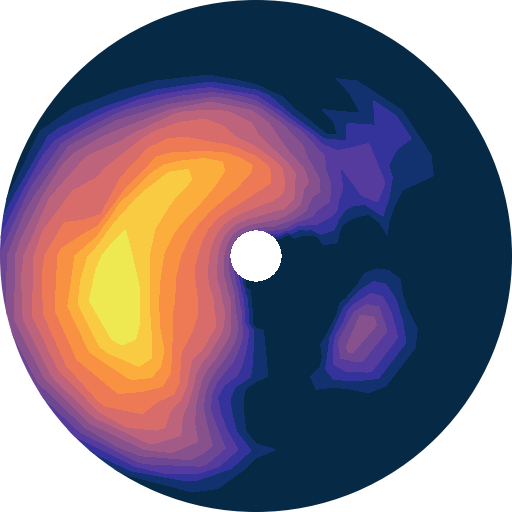

===========
Quick start
===========

Wavespectra is an open source project for processing ocean wave spectral data.
The library is built on top of xarray and provides reading and writing of different
spectral data formats, calculation of common integrated wave paramaters, spectral
partitioning and spectral manipulation in a package focussed on speed and efficiency
for large numbers of spectra.

Reading spectra from files
--------------------------

Several methods are provided to read various file formats including spectral wave
models like WW3, SWAN, WWM and observation instruments such as TRIAXYS and SPOTTER.

.. ipython:: python
    :okwarning:

    import matplotlib.pyplot as plt
    from wavespectra import read_ww3

    dset = read_ww3("_static/ww3file.nc")
    dset

The `spec` namespace
--------------------

Wavespectra defines a new namespace accessor called `spec` which is attached to `xarray`_
objects. This namespace provides access to methods from the two main objects in wavespectra:

* :py:class:`~wavespectra.specarray.SpecArray`
* :py:class:`~wavespectra.specdataset.SpecDataset`

which extend functionality from xarray's `DataArray`_ and `Dataset`_ objects respectively.

SpecArray
~~~~~~~~~

.. ipython:: python
    :okwarning:

    dset.efth.spec

SpecDset
~~~~~~~~~

.. ipython:: python
    :okwarning:

    dset.spec

Spectral wave parameters
------------------------
Several methods are available to calculate integrated wave parameters. They can be
accessed from both SpecArray (`efth` variable) and SpecDset accessors:

.. ipython:: python
    :okwarning:

    hs = dset.efth.spec.hs()
    hs
    hs1 = dset.spec.hs()
    hs.identical(hs1)

    @suppress
    plt.figure(figsize=(8,5))

    hs.plot.line(x="time");

    @suppress
    plt.legend(("Site 1", "Site 2"))
    @suppress
    plt.title("")

    @savefig hs.png
    plt.draw()

.. ipython:: python
    :okwarning:

    stats = dset.spec.stats(
        ["hs", "hmax", "tp", "tm01", "tm02", "dpm", "dm", "dspr", "swe"]
    )
    stats

    fig, ((ax1, ax2), (ax3, ax4), (ax5, ax6)) = plt.subplots(3, 2, figsize=(8, 6))

    stats.hs.plot.line(ax=ax1, x="time");
    @suppress
    ax1.set_ylabel("$Hs$ (m)")

    stats.hmax.plot.line(ax=ax2, x="time");
    @suppress
    ax2.set_ylabel("$Hmax$ (m)")

    stats.dpm.plot.line(ax=ax3, x="time");
    @suppress
    ax3.set_ylabel("$Dpm$ (deg)")

    stats.dspr.plot.line(ax=ax4, x="time");
    @suppress
    ax4.set_ylabel("$Dspr$ (deg)")

    stats.tp.plot.line(ax=ax5, x="time");
    @suppress
    ax5.set_ylabel("$Tp$ (s)")

    stats.tm01.plot.line(ax=ax6, x="time");
    @suppress
    ax6.set_ylabel("$Tm01$ (s)")

    @suppress
    for ax in [ax1, ax2, ax3, ax4, ax5, ax6]: ax.set_xlabel(""); ax.set_xticks([]); ax.get_legend().remove()

    @savefig many_stats.png
    plt.draw()

Partitioning
------------

Two different partitioning techniques are available, a simple spectral split based on
frequency / direction cutoffs and the watershed algorithm of `Hanson et al. (2008)`_.

Spectral split
~~~~~~~~~~~~~~~

.. ipython:: python
    :okwarning:

    fcut = 1 / 8
    sea = dset.spec.split(fmin=fcut)
    swell = dset.spec.split(fmax=fcut)
    dset.freq.values
    sea.freq.values
    swell.freq.values

    @suppress
    plt.figure(figsize=(8, 4.5))

    dset.spec.hs().isel(site=0).plot(label='Full spectrum', marker='o');
    sea.spec.hs().isel(site=0).plot(label='Sea', marker='o');
    swell.spec.hs().isel(site=0).plot(label='Swell', marker='o');

    @suppress
    plt.legend(loc=0, fontsize=8); plt.title(""); plt.ylabel("$Hs$ (m)"); plt.xlabel("")

    @savefig freq_split_hs.png
    plt.draw()

Watershed
~~~~~~~~~

.. ipython:: python
    :okwarning:

    dspart = dset.spec.partition(dset.wspd, dset.wdir, dset.dpt)
    pstats = dspart.spec.stats(["hs", "dpm"])
    pstats

    fig, (ax1, ax2) = plt.subplots(2, 1, figsize=(8, 8))

    hs.isel(site=0).plot(ax=ax1, label='Full spectrum', marker='o');
    pstats.hs.isel(part=0, site=0).plot(ax=ax1, label='Partition 0 (sea)', marker='o');
    pstats.hs.isel(part=1, site=0).plot(ax=ax1, label='Partition 1 (swell 1)', marker='o');
    pstats.hs.isel(part=2, site=0).plot(ax=ax1, label='Partition 2 (swell 2)', marker='o');
    pstats.hs.isel(part=3, site=0).plot(ax=ax1, label='Partition 3 (swell 3)', marker='o');

    @suppress
    plt.legend(loc=0, fontsize=8); ax1.set_title(""); ax1.set_ylabel("$Hs$ (m)"); ax1.set_xlabel(""); ax1.set_xticklabels([])

    dset.spec.dpm().isel(site=0).plot(ax=ax2, label='Full spectrum', marker='o');
    pstats.dpm.isel(part=0, site=0).plot(ax=ax2, label='Partition 0 (sea)', marker='o');
    pstats.dpm.isel(part=1, site=0).plot(ax=ax2, label='Partition 1 (swell 1)', marker='o');
    pstats.dpm.isel(part=2, site=0).plot(ax=ax2, label='Partition 2 (swell 2)', marker='o');
    pstats.dpm.isel(part=3, site=0).plot(ax=ax2, label='Partition 3 (swell 3)', marker='o');

    @suppress
    plt.legend(loc=0, fontsize=8); ax2.set_title(""); ax2.set_ylabel("$Dpm$ (deg)"); ax2.set_xlabel("")

    @savefig watershed_hs.png
    plt.draw()

Plotting
--------

Wavespectra wraps the plotting functionality from `xarray`_ to allow easily defining
frequency-direction spectral plots in polar coordinates.

.. ipython:: python
    :okwarning:

    ds = dset.isel(site=0, time=[0, 1]).spec.split(fmin=0.05, fmax=2.0)
    @savefig faceted_polar_plot.png
    ds.spec.plot(
        kind="contourf",
        col="time",
        as_period=False,
        normalised=True,
        logradius=True,
        add_colorbar=False,
        figsize=(8, 5)
    );

Plotting Hovmoller diagrams of frequency spectra timeseries can be done in only a few lines.

.. ipython:: python
    :okwarning:

    import cmocean

    @suppress
    plt.figure(figsize=(8, 4))

    ds = dset.isel(site=0).spec.split(fmax=0.18).spec.oned().rename({"freq": "period"})
    ds = ds.assign_coords({"period": 1 / ds.period})
    ds.period.attrs.update({"standard_name": "sea_surface_wave_period", "units": "s"})

    @savefig hovmoller_plot.png
    ds.plot.contourf(x="time", y="period", vmax=1.25, cmap=cmocean.cm.thermal, levels=10);

Selecting
---------

Wavespectra complements xarray's selecting_ and interpolating_ functionality with functions to select and
interpolate from `site` coordinates with the :py:meth:`~wavespectra.specdataset.SpecDataset.sel` method.

.. ipython:: python
    :okwarning:

    idw = dset.spec.sel(
        lons=[92.01, 92.05, 92.09],
        lats=[19.812, 19.875, 19.935],
        method="idw"
    )
    idw

    @suppress
    plt.figure(figsize=(8, 4.5))
    p = plt.scatter(dset.lon, dset.lat, 80, dset.isel(time=0).spec.hs(), label="Dataset points");
    p = plt.scatter(idw.lon, idw.lat, 100, idw.isel(time=0).spec.hs(), marker="v", label="Interpolated point");

    @suppress
    plt.legend(); plt.colorbar(p, label="Hs (m)")

    @savefig interp_stations_plot.png
    plt.draw()

The `nearest` neighbour and `bbox` options are also available besides inverse distance weighting (idw).

.. _SpecArray: https://github.com/wavespectra/wavespectra/blob/master/wavespectra/specarray.py
.. _SpecDataset: https://github.com/wavespectra/wavespectra/blob/master/wavespectra/specdataset.py
.. _xarray: https://xarray.pydata.org/en/stable/
.. _xarray_plot: https://xarray.pydata.org/en/stable/plotting.html
.. _faceting: https://xarray.pydata.org/en/stable/plotting.html#faceting
.. _selecting: https://xarray.pydata.org/en/latest/indexing.html
.. _interpolating: https://xarray.pydata.org/en/latest/interpolation.html
.. _DataArray: http://xarray.pydata.org/en/stable/generated/xarray.DataArray.html
.. _Dataset: http://xarray.pydata.org/en/stable/generated/xarray.Dataset.html
.. _`Hanson et al. (2008)`: https://journals.ametsoc.org/doi/pdf/10.1175/2009JTECHO650.1
