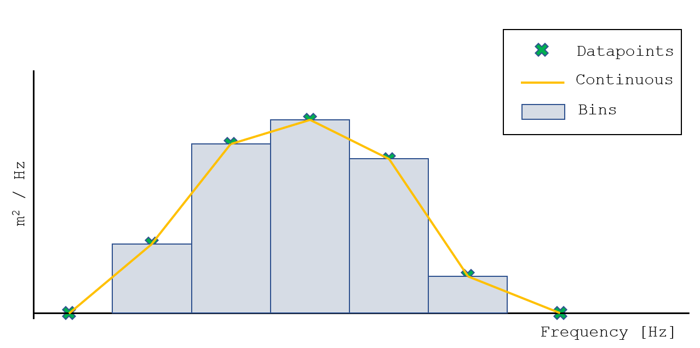
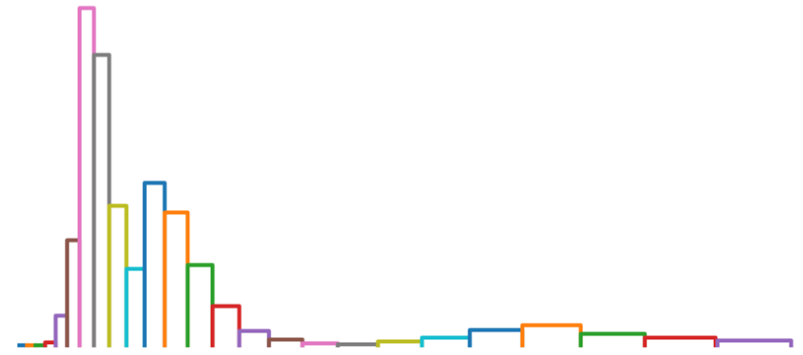
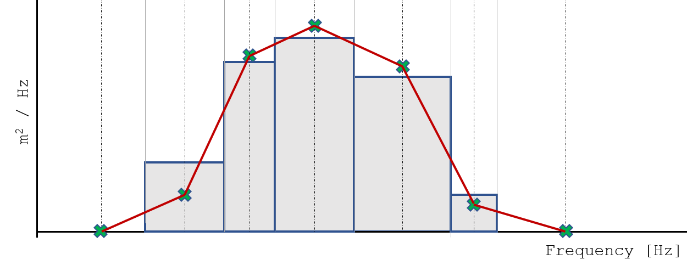

.. image:: _static/wavespectra_logo.png
    :width: 150 px
    :align: right

==========================
Wave spectral definitions
==========================

Some things look trivial but are not. Here comes trouble, brace yourself.

Wave-spectra are continuous by nature. There is no physical reson for discontinuities in the spectral shape (thank you visocity).
This means that the spectral shape s(frequency, dir) will be smooth.

To store a spectral shape it can be discretized into a finite number of points. The true specrtral shape can then be re-constructed by fitting a curve* through these datapoints.

This approach straight forward when constructing wave spectra from an emperical formulation such as ochi-hubble or jonswap.

When measuring waves you don't measure a spectrum. You measure a wave-train: A sequence of water-elevations over time. A spectrum can be constructed by filtering. windowing and FFT.
The result of this analysis is a finite number of frequency bins and the amount of energy in that bin. This results in another way to store spectral data: bins and the amount of energy per bin.

Consequences
=============
There are two major ways of storing spectral data:

1. As points on a continuous curve
2. As energy bins defined by the center of the bin and the amount of energy in that bin.

Storing the spectrum as a continuous curve is more practical because it allows for re-gridding the frequency grid. It also corresponds to the physical nature of the spectrum.

The problem is when you get data, it is not always (read: "never") clear which representation is used. Both stored data-formats look identical: a table with frequencies and energies. For bin data the energy *may* be given as the energy in that bin [m2] instead of as wave energy density.

So what are the implications?

The image below shows the spectrum as reconstructed from the same data-point using both methods.

In this example the frequency grid is equidistant and the the spectral energy starts and ends with zero.

In this case:
1. The total energy (the area under the spectrum) is identical: m_0 is the same.
2. The bin representation holds more energy at its peak(s).
3. The continuous representation hold more energy at its outer edges (or throughs).

These differences may or may not be significant depending on the purpose and the resolution of the frequency grid.

Non-constant bin widths
------------------------

It is fairly common that the frequency grid is not equidistant. Sometimes there are jumps in bin-size (datawell waverider) or the grid is exponential. The following figure shows and actaul weather forecast as received from a commercial company.

For non-equidistant frequency grids the total energy of the spectrum (m_0) is different depending on whether the binned on continuous representation is used. In the following figure the areas of A and B are clearly different resulting in a different total area of the spectrum. Not good.

So how to solve?
=================

We need to re-write the binned data as a continuous curve which can be interpolated linearly. There are multiple ways to do this and none of them is perfect.

1. The total amount of energy (area under the curve) should stay constant
2. It shall be possible to perform the conversion on a great number of spectra and or spectral directions. If the freqency grid is changed, then the change shall be the same for all spectra under consideration. Same for adding additional frequencies
3. The amount of energy in each bin interval shall stay the same.
4. The curve shall be smooth

The method implemented is illustrated below.

A curve is constructed on the same frequency grid as the bins. The energy-density at each point is then solved iteratively.
This method is not prefect as it may leak energy to the outside of the spectrum. A caveat is that some of the solved energy densities my become negative. If these are encountered then the energy density at these points is set to zero and the whole spectrum is scaled up to maintain the total amount of energy.

Alternatives:
--------------
Alternative methods involve introducing additional frequency points at the edges of the bins. This can be a solution for the shortcomings of the implemented method. However it also results in a system with more unknownws than equations and thus not a solution which is not unique.
